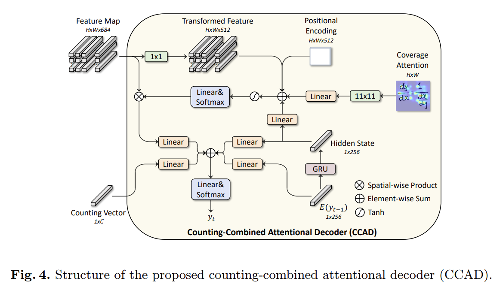

# HMER
## Counting Aware Network

### Introduction
本篇工作主要有以下两点贡献：
* 设计了一个弱监督的counting module: Multi-Scale Counting Module(MSCM)(*with this counting module, an encoder-decoder model can be better aware of each symbol's position*)
* 提出了一个可以联合训练symbol counting 和HMER的方法

将MSCM和DWAP结合起来，提出了CAN(counting aware network)

### Related Work
#### HMER
此部分略去
#### Object Counting
Object Counting可以分为两种：detection-based和regression-based
* detection-based   
    - obtain the number by detecting each instance
* regression-based
    - learn to count by regressing a density map

### Methodology
#### MSCM

本模块包含 多尺度的特征提取，通道注意力和求和池化
##### 多尺度的特征提取

采用平行的两个卷积分支，卷积核大小分别为$3\times 3$和$5\times 5$.通道注意力的引入可以进一步加强提取到的特征信息。对其中一个分支进行数学上的阐述。令$\mathcal{H}$为$3\times 3$或$5\times 5$卷积层输出的特征图，那么得到增强特征$S$的计算过程如下
$$
\mathcal{Q}= \sigma(W_1(G(\mathcal{H}))+b_1) \\
\mathcal{S}=\mathcal{Q}\otimes g(W_2\mathcal{Q}+b_2)
$$
其中$G$代表Global average pooling, $g(\cdot)$代表ReLU和sigmoid激活函数, $W_1,W_2, b_1,b_2$则为Linear层中可学习的参数
得到的增强特征$S$将被输入到$1\times 1$卷积中来将channel数量调整到$C$, 其中$C$即为symbol classes.我们所期望的情况是得到的symbol counting的结果主要是由前景(即symbol)产生，背景产生的值应当接近于零。所以，$1\times 1$卷积输出的结果将再经过一次sigmoid操作,生成pixel value在$(0,1)$内的counting map$\mathcal{M}\in \mathbb{R}^{H\times W\times C}$。而每一个$\mathcal{M}_i \in \mathbb{R}^{H\times W}$都反映第$i$个symbol的位置信息。$\mathcal{M}$事实上即为**pseudo density map**, 再通过sum pooling操作最终生成counting vector$\mathcal{V}^f\in \mathbb{R}^{1\times C}$
$$
\mathcal{V}_i=\sum\limits_{p=1}^H\sum\limits_{q=1}^{W}M_{i,pq}
$$

##### Counting-Combined Attentional Decoder

输入为2D特征图$\mathcal{F}\in \mathbb{R}^{H\times W\times 684}$, 首先经过一个$1\times 1$卷积来改变通道数，得到**transformed feature**$\mathcal{T}\in \mathbb{R}^{H\times W\times 512}$, 并加上固定的位置编码$\mathcal{P}\in \mathbb{R}^{H\times W\times 512}$。
在decoding过程中，给定时间步$t$, 下式为attention weight($\alpha_t\in \mathbb{R}^{H\times W}$)的计算过程
$$
e_t = w^T\tanh(\mathcal{T}+\mathcal{P}+W_a\mathcal{A}+W_hh_t)+b\\
\alpha_{t,ij}=\exp(e_{t,ij})/ \sum\limits_{p=1}^{H}\sum\limits_{q=1}^W e_{t,pq}
$$
将得到的attention weight $\alpha_t$ 和 feature map$\mathcal{F}$做spatial-wise product得到context vector $\mathcal{C}\in\mathbb{R}^{1\times 256}$.在之前的HMER方法中，$y_t$仅仅是由context vector$\mathcal{C}$, hidden state$h_t$, embedding$E(y_{t-1})$。最终$p(y_t)$即由下式给出$$
p(y_t)={\text{softmax}}(w_o^T(W_c\mathcal{C}+W_v\mathcal{V}+W_th_t+W_eE)) + b_o\\
y_t \sim p(y_t)
$$